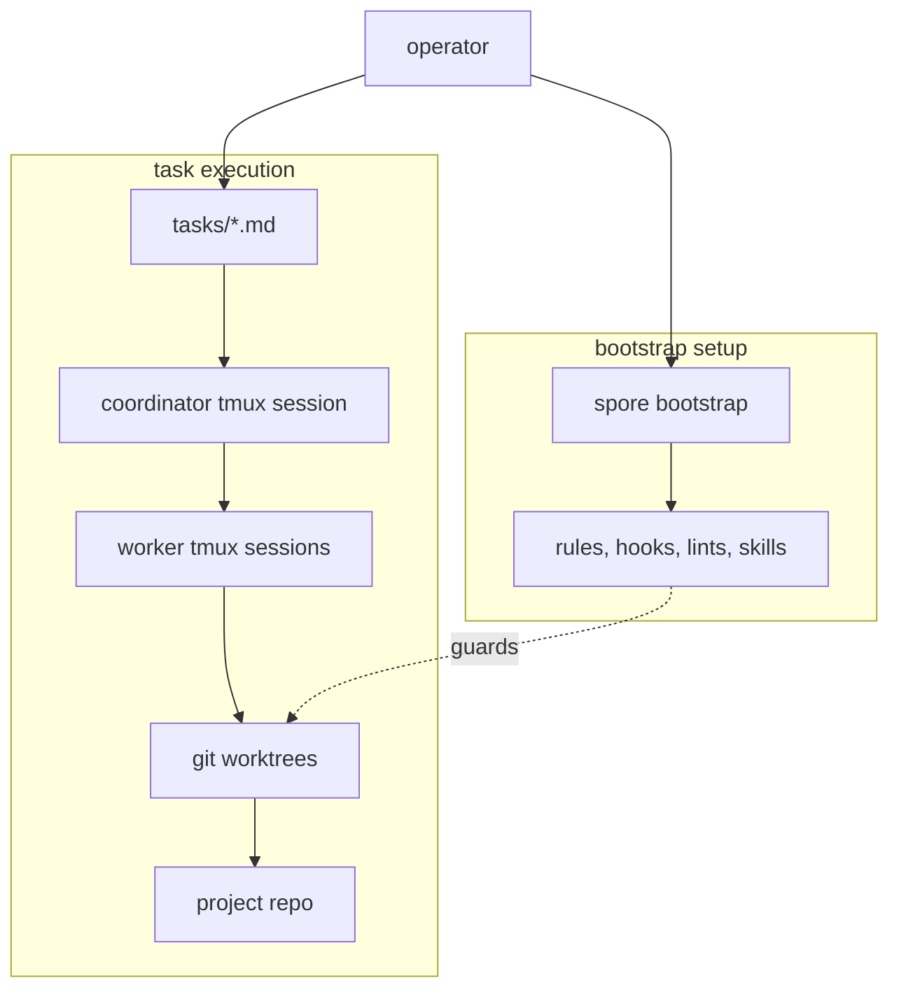

<p align="center">
  
</p>

# spore

[](https://github.com/versality/spore/actions/workflows/ci.yml)
[](https://codecov.io/gh/versality/spore)

Spore is a small, local harness for LLM coding agents. It plants rules,
task files, hooks, validation gates, and tmux worker sessions into an
existing repo so agents can work on explicit tasks without turning the
project into a SaaS workflow.

**Status:** beta. The kernel, bootstrap stage gates, fleet coordinator,
budget tracking, and evidence-gated task closes are in place and are
being dogfooded on live projects.

## What It Feels Like

Spore keeps agent work inside the repo and tools you already trust. It
adds just enough structure for agents to take real tasks without hiding
their work in chat:

- tasks are explicit work orders, not remembered prompt context;
- each active task gets its own git worktree and tmux session;
- a coordinator starts workers, watches progress, and reaps stale
  sessions;
- hooks and lints stop obvious bad moves before task close;
- done requires evidence: commits, changed files, tests, or a written
  reason a proof does not apply.

The result is closer to a disciplined local workshop than a hosted
agent platform. You can attach to tmux, read the task file, inspect the
branch, kill the fleet, or run the same checks yourself.

## Operator Flow

Install the CLI with Nix:

```sh
nix profile install github:versality/spore
```

Or build from a checkout with Go 1.25+:

```sh
go build -o ~/.local/bin/spore ./cmd/spore
```

Adopt an existing project:

```sh
cd /path/to/project
spore bootstrap
```

`spore bootstrap` is re-entrant. Each run checks what it can prove,
records the completed gates, then prints the first blocker that still
needs operator or repo work. In plain terms, bootstrap moves through:

1. map the repo and collect project facts;
2. find the test and validation commands;
3. document how credentials are supplied without storing secrets;
4. confirm the README matches the real workflow;
5. run validation and confirm the pilot/agent rules are aligned;
6. enable the worker fleet.

The CLI still uses short stage ids such as `repo-mapped`,
`validation-green`, and `worker-fleet-ready` so agents can resume the
same bootstrap without guessing.

When the project is worker-ready, create work and start the fleet:

```sh
spore task new "first task"
spore fleet enable
spore fleet reconcile
```

Worker sessions live under tmux names like
`spore/<project>/<slug>`. The coordinator session is
`spore/<project>/coordinator`.

Fresh-server install uses nixos-anywhere:

```sh
spore infect 203.0.113.7 --ssh-key ~/.ssh/id_ed25519
```

`spore infect` is destructive: it wipes the target host and installs
NixOS over SSH. Point it only at a freshly provisioned Linux VM that is
root-reachable over SSH, can kexec, and has no data worth keeping. The
machine running spore needs Nix with flakes enabled plus `ssh` and
`ssh-keygen` on PATH.

The `--ssh-key` value is the private key nixos-anywhere uses to log
into the target during install. Its `.pub` sibling must exist because
spore writes that public key into the installed system for post-install
root SSH access:

```sh
ssh-keygen -y -f ~/.ssh/id_ed25519 > ~/.ssh/id_ed25519.pub
```

By default spore stages the bundled minimal flake from
`bootstrap/flake/`. Pass `--flake <path-or-attr>` when the target needs
your own NixOS config, disk layout, packages, or host settings:

```sh
spore infect 203.0.113.7 \
  --ssh-key ~/.ssh/id_ed25519 \
  --flake ./nixos#web-1
```

The kickstart path is one command that installs NixOS, copies the
current repo to the box, and starts the coordinator handoff surface
under the `spore` user. Choose the initial coordinator provider and
model explicitly:

```sh
spore infect 203.0.113.7 \
  --ssh-key ~/.ssh/id_ed25519 \
  --repo /path/to/project \
  --coordinator-agent claude \
  --coordinator-model sonnet

ssh -t spore@203.0.113.7
```

For a Codex-backed coordinator, use the Codex provider, model, and
reasoning effort instead:

```sh
spore infect 203.0.113.7 \
  --ssh-key ~/.ssh/id_ed25519 \
  --repo /path/to/project \
  --coordinator-agent codex \
  --coordinator-model gpt-5.5 \
  --coordinator-effort high
```

If the selected agent needs interactive login, `ssh -t spore@<ip>`
attaches to the coordinator tmux pane and leaves the agent login chooser
visible.

See [docs/infect.md](docs/infect.md) for full flag behavior and
failure hints.

## Matter Plugins

Matter plugins pull work from external sources (Linear, GitHub
Issues, ad-hoc adapters) and mirror local task transitions back to
them. Configure one or more in `spore.toml` under
`[matter.<name>]`, or via `SPORE_MATTER_<NAME>__<KEY>` env vars
when the NixOS module is the source of truth (the loader merges
both).

The fleet reconciler runs `Sync` against every enabled matter
before it enumerates tasks, so new upstream tickets land as
`tasks/<slug>.md` files automatically on the next pass. When a
task carrying matter metadata flips to done, an `OnDone` hook
mirrors the close back upstream; a fallback sweep on the next
`Sync` covers misses (reconciler off, adapter down, task edited
out of band).

Tasks created by a matter carry three frontmatter keys: `matter`
(adapter name), `matter_id` (upstream id), and `matter_url`
(deep link, optional).

### Linear

The bundled `linear` adapter polls a configured team for issues in
a ready state, projects each one to `tasks/<slug>.md`, pushes the
issue to in-progress, and mirrors `status: done` flips back to a
configured done state.

```toml
# spore.toml
[matter.linear]
enabled = true
team = "MAR"                       # team key, required
ready_state = "Ready"              # default
in_progress_state = "In Progress"  # default
done_state = "Done"                # default
api_key_env = "LINEAR_API_KEY"
# or, when the NixOS module supplies the secret via systemd:
# api_key_file = "linear-api-key"
```

For NixOS deployments, configure the same shape under
`services.spore-fleet.matters.linear`. Secrets ride systemd
`LoadCredential` and never enter Nix evaluation or `/nix/store`.
See [nixosModules/spore-fleet.nix](nixosModules/spore-fleet.nix).

## Graceful Deployment

When the NixOS module is enabled with `gracefulDeploy.enable =
true` (the default), pre and post activation hooks drain active
workers around `nixos-rebuild switch` and colmena deploys:

- pre-activation disables the kill-switch, drops a wrap-up
  message into every active worker's inbox, waits up to
  `gracefulDeploy.timeout` seconds for them to flush, then kills
  any holdouts;
- post-activation re-enables the kill-switch so the next
  reconcile pass repopulates the fleet.

The `preScript` and `postScript` paths are also exposed as
read-only options so a colmena `deployment.preActivation` /
`postActivation` hook can drive the same drain remotely. Set
`gracefulDeploy.enable = false` for one-off worker tiers whose
tasks should never see a wrap-up signal.

## Developer Entry

Use the flake dev shell for the toolchain used by CI:

```sh
nix develop
just check
just build
```

`just check` runs formatting checks, Go vet, golangci-lint, Spore's
own lint suite, Go tests, govulncheck, and `nix flake check`.
`just build` builds the Go binary and the flake package.
`just coverage` writes local coverage reports under `coverage/` and is
required in CI before the advisory Codecov upload step runs.

Without entering the shell:

```sh
nix develop --command just check
```

The CLI is plain Go. Start at [cmd/spore/main.go](cmd/spore/main.go)
for command routing.

## Architecture



Main extension points:

- [internal/bootstrap/](internal/bootstrap/) detects bootstrap stages
  and pairs with runbooks in [bootstrap/stages/](bootstrap/stages/).
- [internal/task/](internal/task/) owns task frontmatter, lifecycle,
  worktree creation, inbox handling, and merge close paths.
- [internal/fleet/](internal/fleet/) reconciles active tasks with tmux
  worker sessions and drives the matter sync prelude.
- [internal/matter/](internal/matter/) is the plugin layer for
  external work sources (e.g. [linear](internal/matter/linear/)).
- [internal/hooks/](internal/hooks/) emits and runs Claude Code hook
  bindings.
- [internal/lints/](internal/lints/) holds portable repo lints.
- [internal/composer/](internal/composer/) renders instruction files
  from rule fragments in [rules/](rules/).
- [nixosModules/spore-fleet.nix](nixosModules/spore-fleet.nix)
  autostarts fleet reconciliation on NixOS hosts.

## Docs

- [docs/design.md](docs/design.md) - origin, design rationale, and
  unresolved tradeoffs.
- [docs/worker-dispatch.md](docs/worker-dispatch.md) - why workers
  are spawned through tmux and how the merge close path works.
- [docs/evidence.md](docs/evidence.md) - the evidence contract for
  task close gates.
- [docs/budget.md](docs/budget.md) - rolling Anthropic spend tracking
  and budget advice.
- [bootstrap/README.md](bootstrap/README.md) - bootstrap layout,
  skills, stage runbooks, and smoke test.

## License

Spore is licensed under the Apache License, Version 2.0. See
[LICENSE](LICENSE) for the full text.
