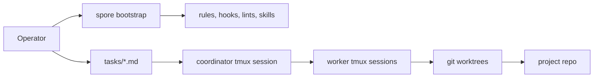

<p align="center">
  
</p>

# spore

Spore is a small, local harness for LLM coding agents. It plants rules,
task files, hooks, validation gates, and tmux worker sessions into an
existing repo so agents can work on explicit tasks without turning the
project into a SaaS workflow.

**Status:** beta. The kernel, bootstrap stage gates, fleet coordinator,
budget tracking, and evidence-gated task closes are in place and are
being dogfooded on live projects.

## Choose a Path

| If you want to understand Spore | If you want to build or extend it |
|---------------------------------|-----------------------------------|
| Read [What It Feels Like](#what-it-feels-like), then [Operator Flow](#operator-flow). | Read [Developer Entry](#developer-entry), then [Architecture](#architecture). |

## What It Feels Like

You keep your repo, your tests, your shell, and your git history.
Spore adds a lightweight operating loop around them:

- Work is written down as `tasks/<slug>.md`.
- Each active task gets its own git worktree and tmux session.
- A coordinator watches the queue and starts or reaps workers.
- Hooks and lints stop obvious bad moves before task close.
- Done means there is evidence: commits, changed files, tests, or a
  written reason a proof does not apply.

The result is closer to a disciplined local workshop than a hosted
agent platform. You can attach to tmux, read the task file, inspect the
branch, kill the fleet, or run the same checks yourself.

## Operator Flow

Install the CLI with Nix:

```sh
nix profile install github:versality/spore
```

Or build from a checkout with Go 1.25+:

```sh
go build -o ~/.local/bin/spore ./cmd/spore
```

Adopt an existing project:

```sh
cd /path/to/project
spore bootstrap
```

`spore bootstrap` is re-entrant. Each run advances through the stage
gates it can prove, then prints the current blocker:

```text
repo-mapped -> info-gathered -> tests-pass -> creds-wired ->
readme-followed -> validation-green -> pilot-aligned ->
worker-fleet-ready
```

When the project is worker-ready, create work and start the fleet:

```sh
spore task new "first task"
spore fleet enable
spore fleet reconcile
```

Worker sessions live under tmux names like
`spore/<project>/<slug>`. The coordinator session is
`spore/<project>/coordinator`.

Fresh-server install is available separately:

```sh
spore infect 203.0.113.7 --ssh-key ~/.ssh/id_ed25519
```

`spore infect` wraps nixos-anywhere and wipes the target host. See
[docs/infect.md](docs/infect.md) for flags and prerequisites. The
planned one-command "infect and copy this repo" flow is tracked in
[docs/todo/kickstart-onecommand.md](docs/todo/kickstart-onecommand.md).

## Developer Entry

Use the flake dev shell for the toolchain used by CI:

```sh
nix develop
just check
just build
```

`just check` runs formatting checks, Go vet, golangci-lint, Spore's
own lint suite, Go tests, govulncheck, and `nix flake check`.
`just build` builds the Go binary and the flake package.

Without entering the shell:

```sh
nix develop --command just check
```

The CLI is plain Go. Start at [cmd/spore/main.go](cmd/spore/main.go)
for command routing.

## Architecture



Main extension points:

- [internal/bootstrap/](internal/bootstrap/) detects bootstrap stages
  and pairs with runbooks in [bootstrap/stages/](bootstrap/stages/).
- [internal/task/](internal/task/) owns task frontmatter, lifecycle,
  worktree creation, inbox handling, and merge close paths.
- [internal/fleet/](internal/fleet/) reconciles active tasks with tmux
  worker sessions.
- [internal/hooks/](internal/hooks/) emits and runs Claude Code hook
  bindings.
- [internal/lints/](internal/lints/) holds portable repo lints.
- [internal/composer/](internal/composer/) renders `CLAUDE.md` from
  rule fragments in [rules/](rules/).
- [nixosModules/spore-fleet.nix](nixosModules/spore-fleet.nix)
  autostarts fleet reconciliation on NixOS hosts.

## Docs

- [docs/design.md](docs/design.md) - origin, design rationale, and
  unresolved tradeoffs.
- [docs/worker-dispatch.md](docs/worker-dispatch.md) - why workers
  are spawned through tmux and how the merge close path works.
- [docs/evidence.md](docs/evidence.md) - the evidence contract for
  task close gates.
- [docs/budget.md](docs/budget.md) - rolling Anthropic spend tracking
  and budget advice.
- [bootstrap/README.md](bootstrap/README.md) - bootstrap layout,
  skills, stage runbooks, and smoke test.

## License

Spore is licensed under the Apache License, Version 2.0. See
[LICENSE](LICENSE) for the full text.
